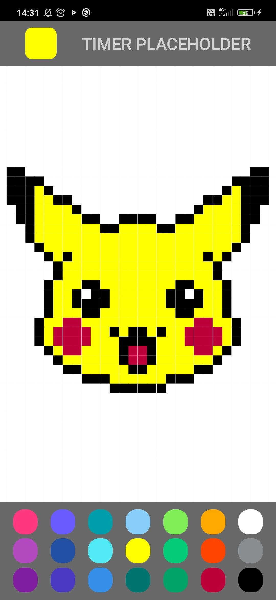

# Pixel War

## Presentation

Pixel-War is an app made with [React Native](https://reactnative.dev/) for a second year project at ENSAI. 

    
    

The app currently look like this

The application features 21 colors. The user can use those colors to draw something on the board. Currently the board is a private one but the goal is to have a shared board. All the users would then be able to draw together.

## Performance Optimization

The application was really slow in the first version. In fact, each pixel was rerendered every time a new color was choosen. In order to reduce the number of rendering, the method ``shouldComponentUpdate`` was used. Now a pixel is rerendered only the next color is different from the current one.

## TODO

- Add a timer on client side
- Transform function objects to class
- Optimize the app with ``shouldComponentUpdate``.

## Known Issues
 
- Some rows have a small gap between them on some phone.